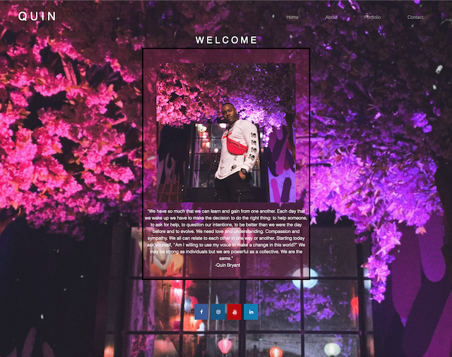
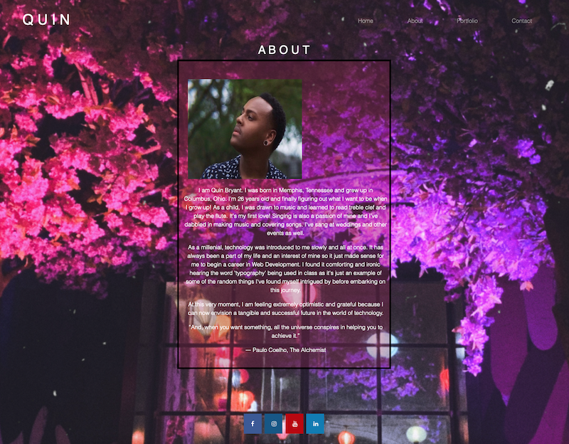

# Portfolio
This project briefly outlines how to generate an effective README.md
## Description
This project explains a little about me along with portfolio of some of my work and a contact form to reach me!
## Used
HTML and CSS
## Questions
If you have any questions, please feel free to contact me below.

<a href='https://aivorlan.github.io/AboutQuin/'>Click Here to visit deployed app</a>
 
 
 <a href='https://github.com/Aivorlan'>Github Profile: Aivorlan</a>
 
Email: OfficialQuinBryant@gmail.com

